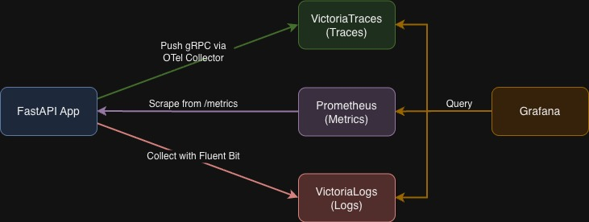
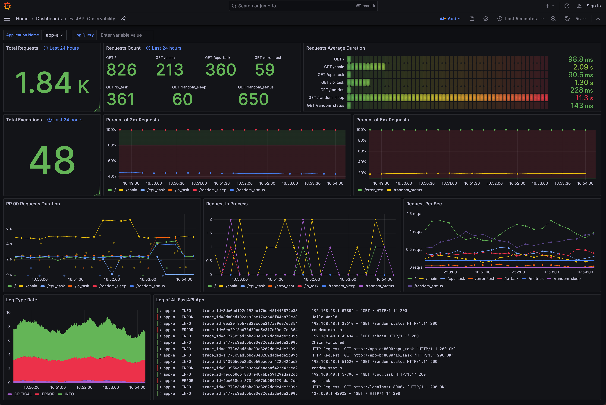
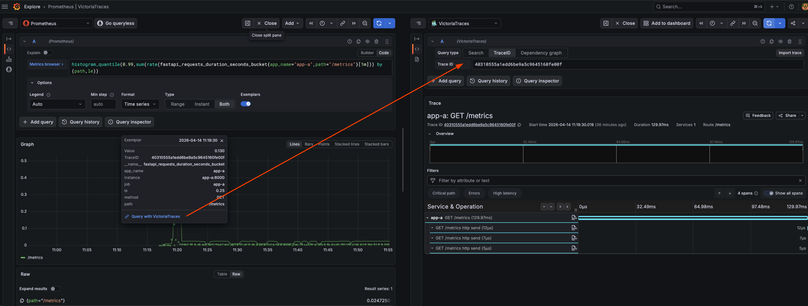
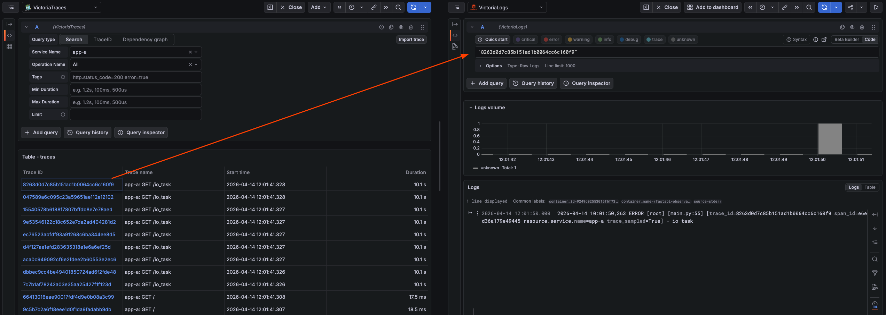
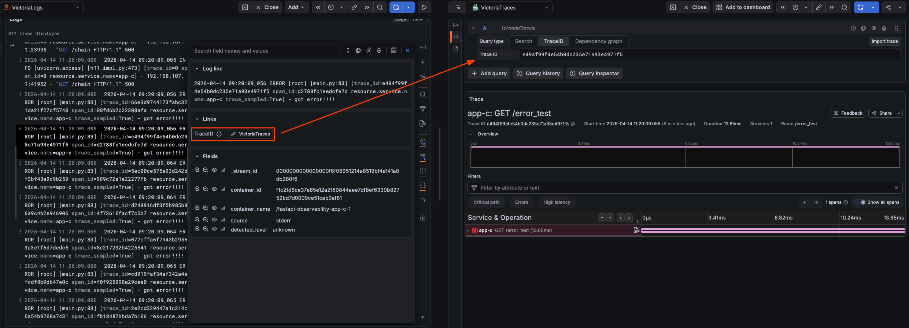
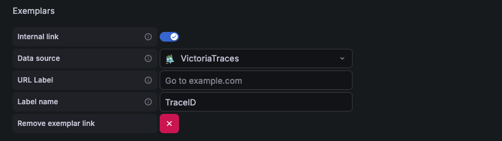
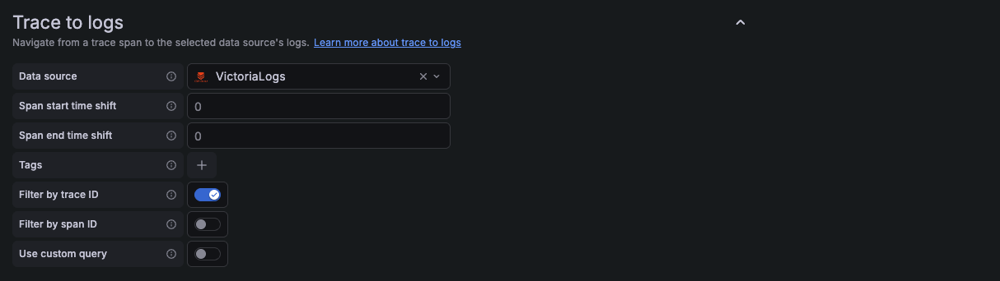
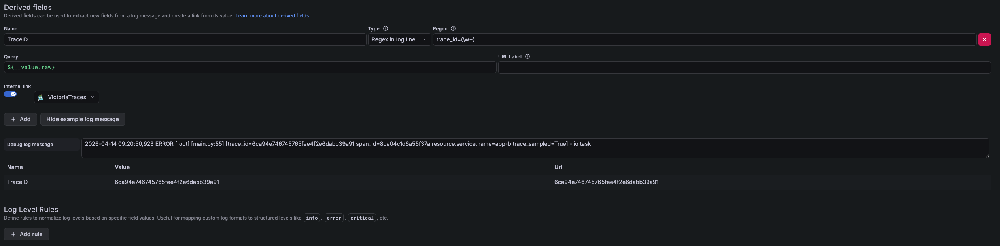

# FastAPI with Observability

Observe the FastAPI application with three pillars of observability on [Grafana](https://github.com/grafana/grafana):

1. Traces with [VictoriaTraces](https://docs.victoriametrics.com/victorialogs/) and [OpenTelemetry Python SDK](https://github.com/open-telemetry/opentelemetry-python)
2. Metrics with [Prometheus](https://prometheus.io/) and [Prometheus Python Client](https://github.com/prometheus/client_python)
3. Logs with [VictoriaLogs](https://docs.victoriametrics.com/victorialogs/) and [Fluent Bit](https://fluentbit.io/)



## Table of contents
- [FastAPI with Observability](#fastapi-with-observability)
  - [Table of contents](#table-of-contents)
  - [Quick Start](#quick-start)
  - [Explore with Grafana](#explore-with-grafana)
    - [Metrics to Traces](#metrics-to-traces)
    - [Traces to Logs](#traces-to-logs)
    - [Logs to Traces](#logs-to-traces)
  - [Detail](#detail)
    - [FastAPI Application](#fastapi-application)
      - [Traces and Logs](#traces-and-logs)
      - [Span Inject](#span-inject)
      - [Metrics](#metrics)
      - [OpenTelemetry Instrumentation](#opentelemetry-instrumentation)
    - [Prometheus - Metrics](#prometheus---metrics)
      - [Prometheus Config](#prometheus-config)
      - [Grafana Data Source](#grafana-data-source)
    - [VictoriaTraces - Traces](#victoriatraces---traces)
      - [Grafana Data Source](#grafana-data-source-1)
    - [VictoriaLogs - Logs](#victorialogs---logs)
      - [Fluent Bit](#fluent-bit)
      - [Grafana Data Source](#grafana-data-source-2)
    - [OpenTelemetry Collector](#opentelemetry-collector)
    - [Grafana](#grafana)
  - [Reference](#reference)

## Quick Start

1. Install [Mise](https://mise.jdx.dev/)

   ```bash
   curl https://mise.run | sh
   ```

2. Install tools (go-task, k6)

   ```bash
   mise install
   ```

3. Start all services

   ```bash
   task docker:up
   ```

4. Generate traffic with k6

   ```bash
   task k6:load-all    # load test all 3 apps in parallel
   task k6:staged      # staged ramp up/hold/ramp down test
   task k6:load        # quick test against all apps
   ```

5. Check predefined dashboard `FastAPI Observability` on Grafana [http://localhost:3000/](http://localhost:3000/) login with `admin:admin`

   Dashboard screenshot:

   

## Explore with Grafana

Grafana provides a great solution, which could observe specific actions in service between traces, metrics, and logs through trace ID and exemplar.

### Metrics to Traces

Get Trace ID from an exemplar in metrics, then query in VictoriaTraces.

Query: `histogram_quantile(.99,sum(rate(fastapi_requests_duration_seconds_bucket{app_name="app-a", path!="/metrics"}[1m])) by(path, le))`



### Traces to Logs

Get Trace ID from span in VictoriaTraces, then query logs in VictoriaLogs using a custom query with the trace ID.



### Logs to Traces

Get Trace ID from log (regex derived field in VictoriaLogs data source), then query in VictoriaTraces.



## Detail

### FastAPI Application

For a more complex scenario, we use three FastAPI applications with the same code in this demo. The toy domain is a tiny e-commerce shop: a `/checkout` endpoint that calls `/charge_card` (I/O-bound payment) and `/calculate_tax` (CPU-bound math) on sibling instances. This cross-service action provides a good example of how to use OpenTelemetry SDK and how Grafana presents trace information.

#### Traces and Logs

We use [OpenTelemetry Python SDK](https://github.com/open-telemetry/opentelemetry-python) to send trace info with gRPC to the OpenTelemetry Collector, which forwards traces to VictoriaTraces via HTTP. Each request span contains other child spans when using OpenTelemetry instrumentation. The reason is that instrumentation will catch each internal asgi interaction ([opentelemetry-python-contrib issue #831](https://github.com/open-telemetry/opentelemetry-python-contrib/issues/831#issuecomment-1005163018)). If you want to get rid of the internal spans, there is a [workaround](https://github.com/open-telemetry/opentelemetry-python-contrib/issues/831#issuecomment-1116225314) in the same issue #831 by using a new OpenTelemetry middleware with two overridden methods for span processing.

We use [OpenTelemetry Logging Instrumentation](https://opentelemetry-python-contrib.readthedocs.io/en/latest/instrumentation/logging/logging.html) to override the logger format with another format with trace id and span id.

```py
# app/utils.py

def setting_otlp(app: ASGIApp, app_name: str, endpoint: str, log_correlation: bool = True) -> None:
    # Setting OpenTelemetry
    # set the service name to show in traces
    resource = Resource.create(attributes={
        "service.name": app_name, # for VictoriaTraces to distinguish source
        "compose_service": app_name # as a query criteria for Trace to logs
    })

    # set the tracer provider
    tracer = TracerProvider(resource=resource)
    trace.set_tracer_provider(tracer)

    tracer.add_span_processor(BatchSpanProcessor(
        OTLPSpanExporter(endpoint=endpoint)))

    if log_correlation:
        LoggingInstrumentor().instrument(set_logging_format=True)

    FastAPIInstrumentor.instrument_app(app, tracer_provider=tracer)
```

Log format with trace id and span id, which is overridden by `LoggingInstrumentor`

```txt
%(asctime)s %(levelname)s [%(name)s] [%(filename)s:%(lineno)d] [trace_id=%(otelTraceID)s span_id=%(otelSpanID)s resource.service.name=%(otelServiceName)s] - %(message)s
```

#### Span Inject

If you want other services to use the same Trace ID, you have to use `inject` function to add current span information to the header. Because OpenTelemetry FastAPI instrumentation only takes care of the asgi app's request and response, it does not affect any other modules or actions like sending HTTP requests to other servers or function calls.

```py
# app/main.py

from opentelemetry.propagate import inject

@app.get("/checkout")
async def checkout(request: Request):
    headers = {}
    inject(headers)  # inject trace info to header

    client: httpx.AsyncClient = request.app.state.httpx
    await client.get("http://localhost:8000/", headers=headers)
    await client.get(f"http://{TARGET_ONE_HOST}:8000/charge_card", headers=headers)
    await client.get(f"http://{TARGET_TWO_HOST}:8000/calculate_tax", headers=headers)

    return {"path": "/checkout"}
```

#### Metrics

Use [Prometheus Python Client](https://github.com/prometheus/client_python) to generate OpenTelemetry format metric with [exemplars](https://github.com/prometheus/client_python#exemplars) and expose on `/metrics` for Prometheus.

In order to add an exemplar to metrics, we retrieve the trace id from the current span for the exemplar and add the trace id dict to the Histogram or Counter metrics.

```py
# app/utils.py

from opentelemetry import trace
from prometheus_client import Histogram

REQUESTS_PROCESSING_TIME = Histogram(
    "fastapi_requests_duration_seconds",
    "Histogram of requests processing time by path (in seconds)",
    ["method", "path", "app_name"],
)

# retrieve trace id for exemplar
span = trace.get_current_span()
trace_id = trace.format_trace_id(
      span.get_span_context().trace_id)

REQUESTS_PROCESSING_TIME.labels(method=method, path=path, app_name=self.app_name).observe(
      after_time - before_time, exemplar={'TraceID': trace_id}
)
```

Because exemplars is a new datatype proposed in [OpenMetrics](https://github.com/OpenObservability/OpenMetrics/blob/main/specification/OpenMetrics.md#exemplars), `/metrics` have to use `CONTENT_TYPE_LATEST` and `generate_latest` from `prometheus_client.openmetrics.exposition` module instead of `prometheus_client` module. Otherwise using the wrong generate_latest the exemplars dict behind Counter and Histogram will never show up, and using the wrong CONTENT_TYPE_LATEST will cause Prometheus scraping to fail.

```py
# app/utils.py

from prometheus_client import REGISTRY
from prometheus_client.openmetrics.exposition import CONTENT_TYPE_LATEST, generate_latest

def metrics(request: Request) -> Response:
    return Response(generate_latest(REGISTRY), headers={"Content-Type": CONTENT_TYPE_LATEST})
```

#### OpenTelemetry Instrumentation

There are two methods to add trace information to spans and logs using the OpenTelemetry Python SDK:

1. [Code-based Instrumentation](https://opentelemetry.io/docs/languages/python/instrumentation/): This involves adding trace information to spans, logs, and metrics using the OpenTelemetry Python SDK. It requires more coding effort but allows for the addition of exemplars to metrics. We employ this approach in this project.
2. [Zero-code Instrumentation](https://opentelemetry.io/docs/zero-code/python/): This method automatically instruments a Python application using instrumentation libraries, but only when the used [frameworks and libraries](https://github.com/open-telemetry/opentelemetry-python-contrib/tree/main/instrumentation#readme) are supported. It simplifies the process by eliminating the need for manual code changes. However, it does not allow for the addition of exemplars to metrics.

### Prometheus - Metrics

Collects metrics from applications.

#### Prometheus Config

Define all FastAPI applications metrics scrape jobs in `config/prometheus/prometheus.yml`. Exemplar storage is enabled with `--enable-feature=exemplar-storage`.

```yaml
...
scrape_configs:
  - job_name: 'app-a'
    scrape_interval: 5s
    static_configs:
      - targets: ['app-a:8000']
  - job_name: 'app-b'
    scrape_interval: 5s
    static_configs:
      - targets: ['app-b:8000']
  - job_name: 'app-c'
    scrape_interval: 5s
    static_configs:
      - targets: ['app-c:8000']
```

#### Grafana Data Source

Add an Exemplars which uses the value of `TraceID` label to create a VictoriaTraces link.



```yaml
name: Prometheus
type: prometheus
access: proxy
url: http://prometheus:9090
isDefault: true
jsonData:
  httpMethod: POST
  exemplarTraceIdDestinations:
    - datasourceUid: victoria-traces
      name: TraceID
```

### VictoriaTraces - Traces

Receives spans from applications via the OpenTelemetry Collector. VictoriaTraces exposes a Jaeger-compatible API for querying traces.

#### Grafana Data Source

Trace to logs setting with custom query to search the trace ID in VictoriaLogs:



```yaml
name: VictoriaTraces
type: jaeger
access: proxy
url: http://victoria-traces:10428/select/jaeger
jsonData:
  tracesToLogs:
    datasourceUid: victoria-logs
    filterByTraceID: true
    filterBySpanID: false
    customQuery: true
    query: "\"$${__trace.traceId}\""
```

### VictoriaLogs - Logs

Collects logs from all services via Fluent Bit.

#### Fluent Bit

Fluent Bit runs as a log collector, receiving logs from Docker containers via the [Fluentd logging driver](https://docs.docker.com/config/containers/logging/fluentd/) (built-in to Docker, no plugin needed) and forwarding them to VictoriaLogs via HTTP.

```yaml
# config/fluentbit/fluent-bit.yaml
service:
  flush: 1
  log_level: info

pipeline:
  inputs:
    - name: forward
      listen: 0.0.0.0
      port: 24224
      tag: docker

  outputs:
    - name: http
      match: "*"
      host: victoria-logs
      port: 9428
      uri: "/insert/jsonline?_stream_fields=container_name&_msg_field=log&_time_field=date"
      format: json_lines
      json_date_format: iso8601
```

#### Grafana Data Source

Uses the `victoriametrics-logs-datasource` plugin. Add a TraceID derived field to extract the trace id and create a VictoriaTraces link.



```yaml
name: VictoriaLogs
type: victoriametrics-logs-datasource
access: proxy
url: http://victoria-logs:9428
jsonData:
  derivedFields:
    - datasourceUid: victoria-traces
      matcherRegex: "trace_id=(\\w+)"
      name: TraceID
      url: "$${__value.raw}"
```

### OpenTelemetry Collector

The OpenTelemetry Collector sits between the FastAPI applications and VictoriaTraces. It receives traces via gRPC (port 4317), applies processing (sampling, filtering), and exports to VictoriaTraces via HTTP.

```
FastAPI apps --gRPC:4317--> OTel Collector --HTTP--> VictoriaTraces:10428
```

The collector config is in `config/otel/collector.yaml` and includes:
- Probabilistic sampling
- Filtering of low-value spans (http.response.start, http.response.body, http.request)
- Batch processing before export

### Grafana

1. Add Prometheus, VictoriaTraces, and VictoriaLogs to the data source with config file `config/grafana/datasource.yml`.
2. Load predefined dashboard with `config/dashboards.yaml` and `config/dashboards/fastapi-observability.json`.
3. The `victoriametrics-logs-datasource` plugin is installed via `GF_INSTALL_PLUGINS` environment variable.

```yaml
# grafana in docker-compose.yaml
grafana:
   image: grafana/grafana:12.4.0
   environment:
      GF_INSTALL_PLUGINS: victoriametrics-logs-datasource
   volumes:
      - ./config/grafana/:/config/grafana/provisioning/datasources # data sources
      - ./config/dashboards.yaml:/config/grafana/provisioning/dashboards/dashboards.yaml # dashboard setting
      - ./config/dashboards:/config/grafana/dashboards # dashboard json files directory
```

## Reference

1. [FastAPI Traces Demo](https://github.com/softwarebloat/python-tracing-demo)
2. [Waber - A Uber-like (Car-Hailing APP) cloud-native application with OpenTelemetry](https://github.com/Johnny850807/Waber)
3. [Intro to exemplars, which enable Grafana Tempo's distributed tracing at massive scale](https://grafana.com/blog/2021/03/31/intro-to-exemplars-which-enable-grafana-tempos-distributed-tracing-at-massive-scale/)
4. [Trace discovery in Grafana Tempo using Prometheus exemplars, Loki 2.0 queries, and more](https://grafana.com/blog/2020/11/09/trace-discovery-in-grafana-tempo-using-prometheus-exemplars-loki-2.0-queries-and-more/)
5. [The New Stack (TNS) observability app](https://github.com/grafana/tns)
6. [VictoriaMetrics Documentation](https://docs.victoriametrics.com/)
7. [OpenTelemetry Collector Documentation](https://opentelemetry.io/docs/collector/)
8. [Fluent Bit Documentation](https://docs.fluentbit.io/)
